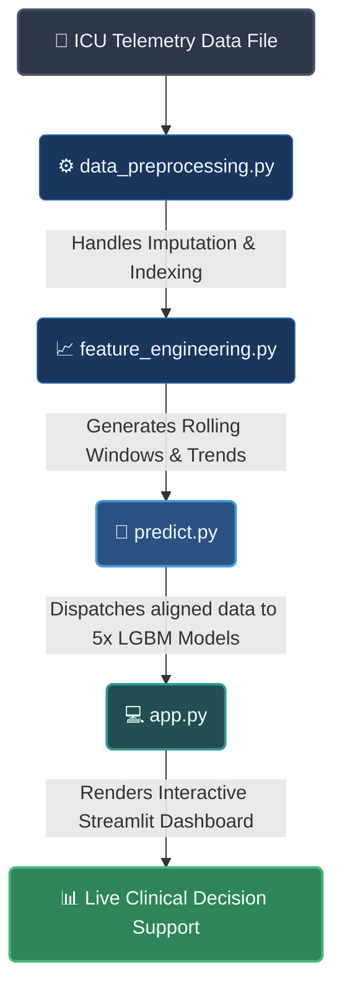

## 📌 Problem Statement

### The Clinical Challenge: A Race Against Time
Sepsis is one of the leading causes of mortality in Intensive Care Units (ICUs) worldwide. It occurs when the body’s response to an infection damages its own tissues and organs. In critical care environments, diagnosing sepsis early is a severe operational challenge:
* **Exponential Risk:** Clinical studies show that for a patient developing sepsis, every single hour of delayed antibiotic treatment increases the risk of mortality by approximately **8%**.
* **Diagnostic Mimicry:** Early physiological signs of sepsis—such as minor elevations in Heart Rate (`HR`) or slight drops in Oxygen Saturation (`O2Sat`)—are highly fluctuating and non-specific. They frequently mimic normal daily baseline variations or other non-lethal ICU conditions, making manual detection prone to human error.
* **Cognitive Overload:** ICU clinical staff manage massive, continuous streams of patient data across dozens of beds simultaneously. Expecting clinicians to manually calculate rolling multi-hour trends and cross-examine physiological correlations in real time is logistically impossible.

### The Engineering Challenge: Learning from Highly Imbalanced Time-Series Data
Translating this clinical emergency into a robust Machine Learning system introduces steep mathematical and data engineering hurdles:
1. **Extreme Class Imbalance:** In standard ICU datasets, only a fraction of patients develop sepsis (typically less than 10%). Standard classification models optimized for overall accuracy will naturally over-fit to the majority class (stable patients), completely failing to predict the critical cases we need to save.
2. **Dynamic Time-Series Context:** A single snapshot of raw vital signs is practically useless. Sepsis manifests as a trajectory; a patient whose heart rate rose steadily by 20 beats over 4 hours is at much higher risk than a patient with a naturally high but stable heart rate. The model must learn the temporal context and direction of changes across varying window lengths.
3. **Missing Clinical Observations:** ICU telemetry data is notoriously messy, filled with missing entries due to sensor disconnections or irregular lab testing schedules. The engineering pipeline must handle these gaps cleanly without dropping critical temporal records.

## 📊 Feature Engineering Pipeline

The core predictive power of the model does not come from raw telemetry, but from reconstructing the patient's physiological trajectory. Raw hourly snapshots are transformed into dynamic temporal features through a multi-stage pipeline:

```text
[Raw Vital Signs] ──> [Hour Transformation] ──> [Forward Fill Imputation] ──> [Multi-Window Rolling Stats] ──> [Velocity Trends]
```
### 1. Temporal Windows & Rolling Aggregations
Sepsis onset is characterized by destabilization over time. The pipeline computes rolling metrics over **3-hour** and **6-hour** moving windows to capture this behavior:
* **Rolling Mean ($\mu$):** Establishes the moving baseline for critical vitals like Heart Rate (`HR`) and Respiratory Rate (`Resp`).
* **Rolling Standard Deviation ($\sigma$):** Measures volatility. A sharp increase in blood pressure volatility, even within normal ranges, often signals systemic stress before a clinical crash.

### 2. Gradient and Velocity Trends
To capture the exact direction and speed of deterioration, the pipeline calculates first-order differences across consecutive hours:

$$\Delta = \text{Vital}_t - \text{Vital}_{t-1}$$

This allows the ensemble to differentiate between a patient with a naturally high but stable heart rate and a patient whose heart rate has spiked by 20% over the last 120 minutes.
### 3. Missing Data Imputation & Forward Filling
ICU data is inherently sparse; lab tests are not ordered hourly, and sensors disconnect. Treating missing values carelessly introduces noise or data leakage.
* **Localized Forward Fill (`ffill`):** The pipeline propagates the last known valid clinical measurement forward in time for that specific patient. This closely mimics real-world clinical realities, as a doctor assumes a patient's lab metrics remain constant until a new test proves otherwise.
* **Patient Boundaries:** Imputation is strictly grouped by `Patient_ID`. The data structures guarantee that a previous patient's terminal state never bleeds into a new patient's initial baseline admission hours.

### 4. Categorical Encoding & Demographics Alignment
Static patient attributes (such as `Age` or gender markers) are aligned alongside dynamic vectors:
* **Target Alignment:** Numerical features are scaled implicitly by the tree-based splits of LightGBM, removing the need for aggressive normalization that might distort extreme, clinically critical outlier values (like a sudden shock blood pressure).

## 🏗️ System Architecture & Data Flow
The system is built on a decoupled, production-ready architecture designed to separate heavy data transformations from the client presentation layer.


## Execution Steps:

### **1.Data Ingestion ```(data_preprocessing.py)```:** 
Reads the raw time-series data. It aligns records by Patient_ID and Hour, then applies localized forward-filling to handle missing laboratory or vital signs natively.

### **2.Feature Generation ```(feature_engineering.py)```:** 
Runs the windowing functions and trend extractors. It flattens any structural indexing to output a clean, high-dimensional DataFrame ready for mathematical inference.

### **3.Inference Engine ```(predict.py)```:** 
Loads the pipeline metadata to strictly enforce feature alignment. It passes the target rows to the 5 trained LightGBM estimators, computes the mean probability, and checks it against the optimized threshold to decide whether to trigger an alarm.

### **Presentation Layer ```(app.py)```:** 
Streamlit intercepts user inputs (selected patient, timeline slider), requests predictions for that specific state from predict.py, and streams interactive trends via Plotly Express.

-----------
## 📂 Directory Structure & Module Pathways

The project implements a modular production architecture, strictly separating model training, evaluation, and downstream deployment services. Below is the mapping of the core workspace modules:

```text
sepsis_early_prediction/
│
├── data/
│   └── cleaned_clinical_data.csv   # Unified, time-series ICU dataset
│
├── models/
│   ├── pipeline_metadata.pkl       # Serialized production features & optimized threshold
│   └── lgbm_fold_ensemble/         # Saved weights for the 5-fold cross-validation models
│
├── src/
│   ├── __init__.py                # Exposes src as a Python package
│   ├── config.py                  # Global constants, hyper-parameters, and absolute path routing
│   ├── data_preprocessing.py      # Cleans telemetry raw strings and handles temporal alignment
│   ├── feature_engineering.py     # Constructs sliding metrics and dynamic velocity trends
│   ├── train.py                   # Executes Stratified K-Fold cross-validation loops
│   ├── evaluate.py                # Sweeps thresholds and generates confusion matrix baselines
│   ├── metrics.py                 # Core tracking functions maximizing clinical F1-Scores
│   ├── predict.py                 # Object-Oriented production inference wrapper class
│   ├── main.py                    # Orchestration script executing the complete pipeline end-to-end
│   └── app.py                     # High-performance web dashboard leveraging st.cache_data
│
├── requirements.txt               # Pinpointed framework and dependency version control
└── README.md                      # Operational system documentation
```
-----
## 🚀 Getting Started & Local Deployment

**1. Environment Setup**
Clone the repository and initialize an isolated virtual environment:

```bash
git clone [https://github.com/YOUR_USERNAME/sepsis_early_prediction.git](https://github.com/YOUR_USERNAME/sepsis_early_prediction.git)
cd sepsis_early_prediction

python3 -m venv venv
source venv/bin/activate  # On Windows use: venv\Scripts\activate
pip install -r requirements.txt
```
### 2. Pipeline Execution
To execute the data cleaning, feature engineering, and ensemble model evaluation locally via the primary orchestrator:
```bash
python src/main.py
```

### 3. Launching the Dashboard
To boot up the interactive clinical support user interface and load the cached streaming telemetry data:
```bash
streamlit run src/app.py
```

